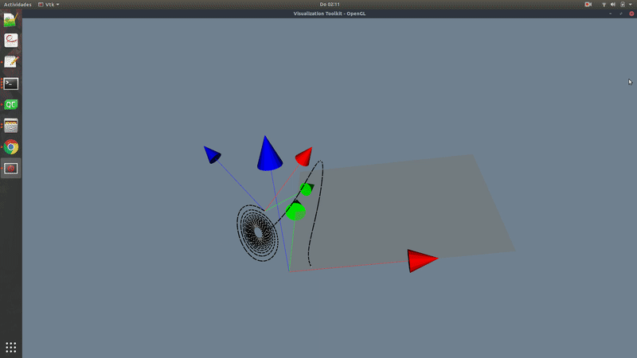

# 3D_PathPlotter_6DoF
A 3D plotter for paths including orientation based on VTK

You need to have VTK installed: then cmake .    build

Run the program giving next to the executable an intput file

The input file should have the format:
t x y z q1 q2 q3 q4   where q stands for the quaternion describing the orientation, q1 the scalar part of the quaternion

TO DO: Right now the orientation based on the quaternion given in the input file is not yet drawn, as in the values I used for testing I did not have orientations. That should be just adding to the Transormation objetc "transform" the transform value based on that quaternion. All the required parameters (the quaternion) are already passed to the function, I one only have to addapat using the adequate VTK function.

What the tool does:

